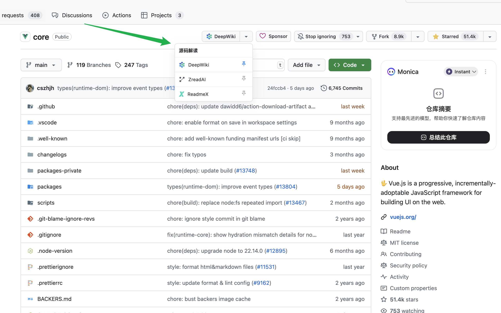

# GitHub 源码解读快捷访问扩展，快捷访问 GitHub 仓库对应的 DeepWiki、ZreadAI、ReadmeX 页面

这是一个浏览器扩展，旨在增强您的 GitHub 浏览体验。它在 GitHub 的仓库页面添加了一个可定制的快捷访问按钮，让您可以一键跳转到与该仓库相关的多个第三方代码阅读和分析网站。

## ✨ 功能特性

- **多站点支持**: 快速跳转到以下网站对应的仓库页面：
  - DeepWiki
  - Zread.ai
  - ReadmeX
- **可定制的默认选项**:
  - 通过点击下拉菜单中的“图钉”图标，可以将任何一个网站设置为您的默认快捷方式。
  - 主按钮会显示您固定的网站，方便您最常用的操作。
- **持久化记忆**:
  - 扩展程序会通过 `chrome.storage` 自动保存您的偏好设置，无需重复配置。
- **无缝的 UI 集成**:
  - 按钮和下拉菜单的设计与 GitHub 的原生界面风格保持一致，支持亮色和暗色模式。
- **动态加载**:
  - 仅在 GitHub 仓库页面加载，对浏览器性能影响极小。

## 🚀 如何使用

1.  **安装扩展**:

    - 从 [发布页面](...) 下载最新版本的 `crx` 或 `zip` 文件。
    - 打开浏览器的扩展管理页面 (`chrome://extensions/`)。
    - 开启“开发者模式”。
    - 将下载的文件拖拽到页面中进行安装。

2.  **使用**:
    - 访问任何一个 GitHub 仓库页面（例如 `https://github.com/vuejs/core`）。
    - 在页面右上方的操作按钮区域（Star, Fork 按钮旁边），您会看到一个新的按钮，默认显示 **DeepWiki**。
    - **直接跳转**: 点击主按钮，会直接在新标签页打开当前仓库在 DeepWiki 上的对应页面。
    - **切换站点**: 点击主按钮右侧的下拉箭头，会弹出一个列表，显示所有支持的网站。
    - **固定偏好**: 在下拉列表中，点击您喜欢的网站右侧的 **图钉** 图标。该网站将成为新的默认选项，并显示在主按钮上。

## 🛠️ 开发与贡献

如果您有兴趣为此项目做出贡献，欢迎：

- 提交 [Issues](...) 报告错误或提出功能建议。
- 创建 [Pull Request](...) 提交您的代码改进。

在本地环境中设置：

1.  克隆本仓库。
2.  在浏览器扩展管理页面，点击“加载已解压的扩展程序”。
3.  选择克隆到本地的仓库文件夹。

## 📄 许可

本项目基于 [MIT License](LICENSE) 开源。
