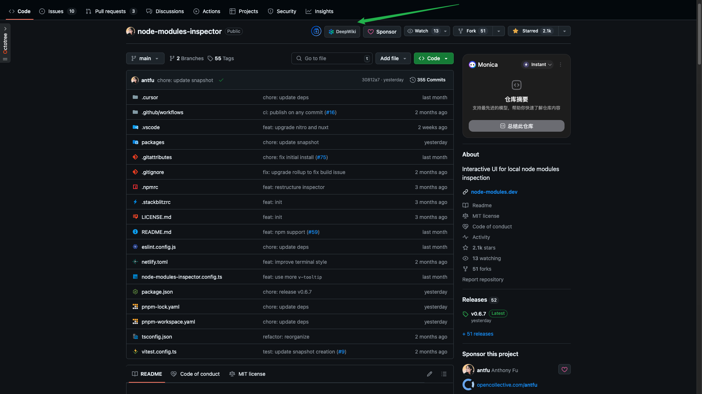

  
  <h1>DeepWiki Quick Access</h1>

  English | <a href="./README.md">中文</a>

## Introduction

DeepWiki Quick Access is a Chrome extension that adds a convenient button to GitHub repository pages, allowing you to access the corresponding DeepWiki page with a single click. The extension seamlessly integrates into the GitHub interface, providing a clean and intuitive user experience.

## Features

- Adds DeepWiki quick access button to GitHub repository pages
- Seamlessly integrates with GitHub interface
- Responsive design that adapts to different screen sizes
- Supports GitHub single-page application navigation (SPA)
- Lightweight design that doesn't impact page loading speed

## Screenshot

## Installation

1. Search for "DeepWiki Quick Access" in the Chrome Web Store or directly visit the [extension page](https://chrome.google.com/webstore/detail/your-extension-id)
2. Click the "Add to Chrome" button
3. Click "Add Extension" in the confirmation dialog

## How to Use

1. Open any GitHub repository page
2. Find the newly added DeepWiki button in the repository navigation bar
3. Click the button to navigate to the corresponding DeepWiki page

## Privacy Statement

This extension does not collect any personal information or usage data. It only runs on GitHub websites and only adds interface buttons and functionality. All operations are performed locally and no data is uploaded to any server.

## Feedback and Support

If you have any questions, suggestions, or feedback, please [submit an issue](https://github.com/your-username/deepwiki-quick-access/issues) or send an email to [your-email@example.com].

## License

This project is licensed under the [MIT License](LICENSE). 
