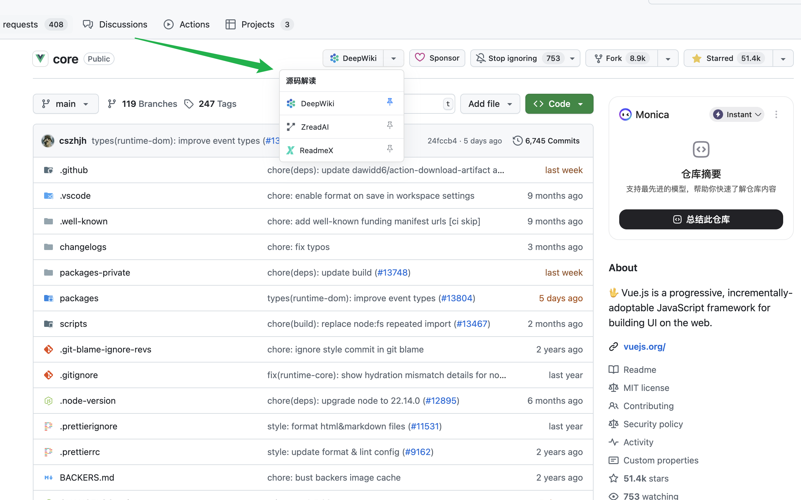

  
  <h1>GitHub Quick Access Extension</h1>

  <a href="./README.md">中文</a> | English

This is a browser extension designed to enhance your GitHub browsing experience. It adds a customizable quick access button to GitHub repository pages, allowing you to jump to multiple third-party code reading and analysis websites related to the repository with a single click.

## ✨ Features

- **Multi-site Support**: Quickly jump to the corresponding repository pages on the following sites:
  - DeepWiki
  - Zread.ai
  - ReadmeX
- **Customizable Default**:
  - Set any site as your default shortcut by clicking the "pin" icon in the dropdown menu.
  - The main button displays your pinned site for your most frequent actions.
- **Persistent Memory**:
  - The extension automatically saves your preferences using `chrome.storage`, so there's no need to reconfigure.
- **Seamless UI Integration**:
  - The button and dropdown menu are designed to match GitHub's native interface style, supporting both light and dark modes.
- **Dynamic Loading**:
  - Loads only on GitHub repository pages, with minimal impact on browser performance.

## 🚀 How to Use

1.  **Installation**:

    - Download the latest version (`crx` or `zip`) from the [Releases page](...).
    - Open your browser's extension management page (e.g., `chrome://extensions/`).
    - Enable "Developer mode".
    - Drag and drop the downloaded file onto the page to install.

2.  **Usage**:
    - Visit any GitHub repository page (e.g., `https://github.com/vuejs/core`).
    - In the action button area at the top right (next to the Star and Fork buttons), you will see a new button, defaulting to **DeepWiki**.
    - **Direct Jump**: Click the main button to open the corresponding page for the current repository on DeepWiki in a new tab.
    - **Switch Site**: Click the dropdown arrow to the right of the main button to reveal a list of all supported sites.
    - **Pin Preference**: In the dropdown list, click the **pin** icon next to your preferred site. It will become the new default and will be displayed on the main button.

## 🛠️ Development & Contribution

If you're interested in contributing to this project, you are welcome to:

- Submit [Issues](...) to report bugs or suggest features.
- Create [Pull Requests](...) to submit your code improvements.

To set up the local environment:

1.  Clone this repository.
2.  In your browser's extension management page, click "Load unpacked".
3.  Select the locally cloned repository folder.

## 📄 License

This project is licensed under the [MIT License](LICENSE).
